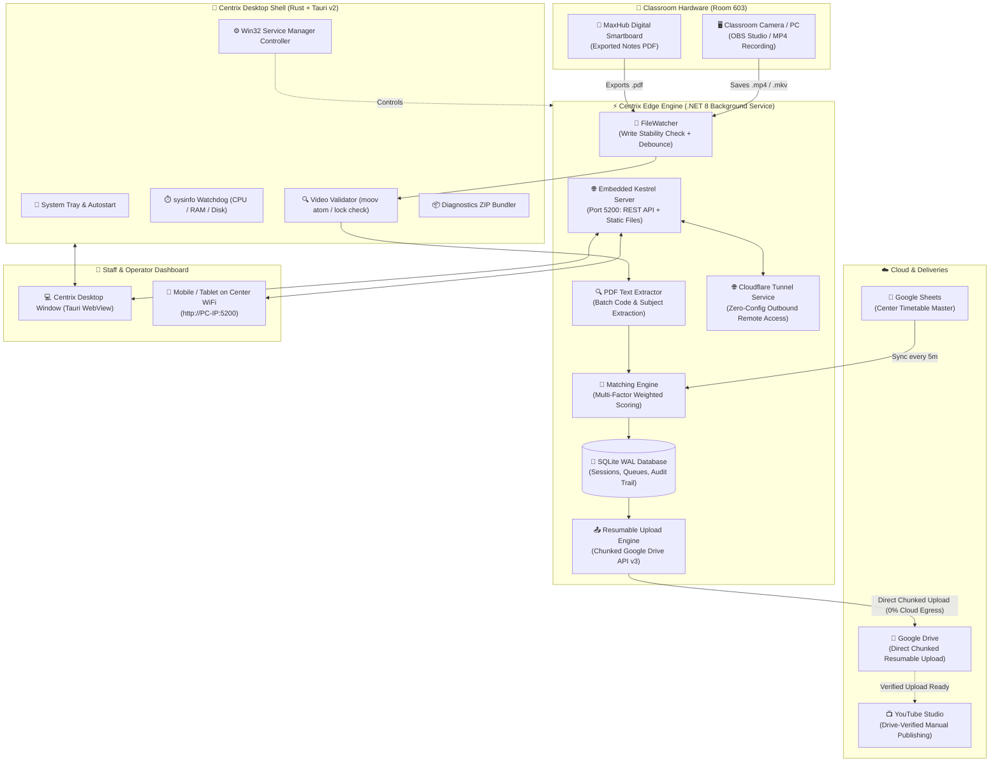

<div align="center">


# ⚡ Centrix

### **Autonomous Classroom Lecture Ingestion, Smart MaxHub Pairing & Resumable Direct-to-Drive Pipeline**

*The edge-first operations engine for modern educational institutions and smart classrooms — ingesting, matching, and delivering thousands of daily lecture recordings and digital board notes with zero cloud storage egress bottlenecks.*

---

[](https://www.rust-lang.org/)
[](https://v2.tauri.app/)
[](https://dotnet.microsoft.com/)
[](https://reactjs.org/)
[](https://www.typescriptlang.org/)
[](https://tailwindcss.com/)
[](https://www.sqlite.org/)
[](https://developers.google.com/drive)
[](#)

[Overview](#-overview) • [Design Philosophy](#-why-centrix-design-philosophy) • [Tech Stack Deep-Dive](#-tech-stack-deep-dive) • [System Architecture](#-system-architecture) • [Confidence Matching Engine](#-multi-factor-confidence-matching-engine) • [Installation & Setup](#-step-by-step-installation-guide) • [Classroom Hardware Setup](#-classroom-hardware-topology) • [Configuration Reference](#-configuration-reference) • [API Contracts](#-api--ipc-contracts-reference) • [Repository Map](#-detailed-directory-structure)

---

</div>

## 📖 Overview

In modern educational centers, hundreds of smart classrooms conduct high-stakes lectures every day. Each session produces two essential digital artifacts:
1. **High-Definition Video Recording (`.mkv`, `.mp4`, `.mov`)**: Captured from the classroom camera via OBS Studio or capture cards.
2. **Interactive Digital Notes (`.pdf`)**: Exported from the smart interactive flat panel (**MaxHub / Digital Smartboard**).

### The Real-World Operational Challenge:
Historically, center staff had to manually rename files, organize them into folders, match timetable batches, and upload gigabytes of data to cloud drives. This manual workflow suffered from:
- **Human Error**: Misnaming files or uploading Physics lectures into Chemistry folders.
- **Student Access Delays**: Lectures took 12–24 hours to reach student apps and study portals.
- **Network Failures**: Large uploads (3 GB – 8 GB) dropped mid-way on center broadband, forcing operators to start from 0%.
- **Prohibitive Cloud Egress Costs**: Routing thousands of multi-gigabyte videos through a central cloud backend costs massive monthly server and bandwidth expenses.

### The Centrix Solution:
**Centrix** is an edge-first, autonomous ingestion and delivery platform. Powered by an ultra-lightweight **Rust (Tauri v2)** desktop shell and a robust **.NET 8** background service, it runs locally on center PCs:
- Automatically detects new recordings when OBS stops writing (debounced write stability).
- Pairs camera video with MaxHub digital board PDF notes by room ID and time window.
- Uses multi-factor confidence scoring to match the lecture with scheduled timetable slots.
- Uploads directly from the classroom PC to Google Drive using chunked resumable streaming (saving 100% cloud egress).
- Provides staff with a mobile and desktop 1-tap review dashboard.
- Enables verified manual YouTube publishing for center operators directly from delivered Drive uploads.

---

## 🎯 Why Centrix? (Design Philosophy)

```
┌────────────────────────────────────────────────────────────────────────────────────────┐
│                                 THE CENTRIX TRINITY                                    │
│                                                                                        │
│   🚀 MAXIMUM AUTOMATION          👥 MINIMUM OPERATOR TIME      💰 ZERO CLOUD EGRESS   │
│   95%+ lectures auto-matched     Only 2-3 ambiguous cases      Files flow PC → Drive  │
│   and uploaded hands-free        reviewed per day in 1 tap     Directly. $0 bandwidth │
└────────────────────────────────────────────────────────────────────────────────────────┘
```

1. **Edge-First & Offline-Resilient**: All video processing, timetable indexing, and queue management happen locally using SQLite (Write-Ahead Logging mode). Even during total internet outages, recording detection and queuing never stop.
2. **Zero Central Video Bottleneck**: Massive video files (2 GB to 8 GB each) are uploaded **directly from the classroom PC to Google Drive** via Google's chunked resumable upload protocol. Video data **never** touches a central proxy server.
3. **Deterministic Multi-Layer Matching**: Rule-based confidence scoring (timetable schedule, file duration, time overlap, file keywords, and PDF first-page text inspection) decides assignments transparently before any fallback.
4. **Human-in-the-Loop When Needed**: If confidence is between 60% and 84%, or if an unscheduled lecture occurred, Centrix routes the lecture to a clean 1-tap review queue for staff confirmation.
5. **Full Auditability**: Every single match, override, and rename is timestamped and logged in SQLite with revertibility.

---

## 🔬 Tech Stack Deep-Dive

Centrix is split into three tightly integrated layers: the **Rust Desktop Shell**, the **.NET 8 Edge Engine**, and the **React 18 Dashboard**.

```
┌────────────────────────────────────────────────────────────────────────────────────────┐
│                                   CENTRIX ECOSYSTEM                                    │
├──────────────────────────────┬──────────────────────────────┬──────────────────────────┤
│    Desktop Shell (Rust)      │   Edge Engine (C# .NET 8)    │   Dashboard UI (React)   │
├──────────────────────────────┼──────────────────────────────┼──────────────────────────┤
│ • Tauri v2 Framework         │ • C# 12 / .NET 8 LTS         │ • React 18 + TypeScript  │
│ • Win32 Service Manager API  │ • Kestrel Embedded Web Host  │ • Vite Build Tooling     │
│ • sysinfo System Watchdog    │ • SQLite (WAL Mode) + Dapper │ • Tailwind CSS UI        │
│ • Native File & Video I/O    │ • Google Drive API v3 (REST) │ • Lucide React Icons     │
│ • Auto-Start & Tray Daemon   │ • PdfPig PDF Text Extractor  │ • Tauri IPC Client       │
│ • Diagnostic ZIP Bundler     │ • Cloudflare Tunnel Bridge   │ • Mobile PWA Manifest    │
└──────────────────────────────┴──────────────────────────────┴──────────────────────────┘
```

---

### Layer 1: Rust Desktop Shell (`web/src-tauri/`)

- **Tauri v2 + Rust**: Eliminates Electron bloat, maintaining an idle memory footprint under 30MB.
- **Windows Service Control (`service.rs`)**: Interacts directly with Windows Service Control Manager (`advapi32.dll` / Win32 API). Starts, stops, restarts, and monitors `Centrix` as a persistent background service.
- **Hardware Watchdog (`health.rs`)**: Uses `sysinfo` to monitor CPU utilization %, available RAM, and target disk mount point free space.
- **Diagnostics Bundler (`diagnostics.rs`)**: Automatically gathers logs, database snapshots, and configuration into a timestamped `.zip` archive for 1-click support troubleshooting.
- **Video Integrity Inspector (`video_validator.rs`)**: Verifies container headers (detects missing MP4 `moov` atoms or corrupt MKV blocks) before queuing for upload.
- **Smart Bandwidth Limiter (`bandwidth.rs`)**: Configures upload rate limits (Mbps) and schedules off-peak upload hours (e.g. 8:00 PM – 8:00 AM) to preserve center daytime bandwidth.

---

### Layer 2: Edge Ingestion Engine (`agent/src/`)

Built on **C# 12 and .NET 8 LTS**, this engine runs as a robust background service:

#### Project Architecture Breakdown:
- **`LectureAgent.Domain`**: Clean Architecture core. Contains domain entities (`LectureSession`, `TimetableSlot`, `RecordingFile`, `AuditLog`), interfaces, and state machine enums.
- **`LectureAgent.Application`**: Orchestration logic, DTOs, request handlers, and timetable reconciliation algorithms.
- **`LectureAgent.Infrastructure`**:
  - **File Watching (`FileWatcher.cs`)**: Watches recording directories with debounced stability timers (waits until file size stops growing for 2000ms, ensuring OBS has finished writing).
  - **MaxHub PDF Reader (`PdfTextExtractor.cs`)**: Parses cover slides of exported digital board PDFs using `PdfPig` to extract batch codes, subject names, and faculty details.
  - **Confidence Matching Engine (`MatchingEngine.cs`)**: Multi-factor scoring engine matching files to scheduled slots.
  - **Chunked Resumable Uploader (`GoogleDriveUploader.cs`)**: Interacts directly with Google Drive REST API v3. Uploads large files in 8MB–16MB chunks with byte-range validation and exponential backoff retry.
  - **SQLite Database (`LectureContext.cs`)**: High-performance local storage with Write-Ahead Logging (WAL) enabled, preventing write contention between watcher, upload worker, and API.
  - **Cloudflare Tunnel (`CloudTunnelService.cs`)**: Optional zero-config outbound tunnel providing secure HTTPS remote access to the center dashboard without port forwarding.
- **`LectureAgent` (Web API & Host)**:
  - ASP.NET Core Kestrel server running on port `5200`.
  - Exposes REST endpoints for local and LAN communication.
  - Hosts the embedded static React PWA dashboard (`wwwroot`).
  - Google OAuth 2.0 PKCE login and DPAPI security for credentials.

---

### Layer 3: React 18 + TypeScript Dashboard (`web/src/`)

A responsive, high-contrast, editorial interface tailored for classroom operators and mobile tablet use:
- **`App.tsx`**: Main application shell, routing, live navigation, and modal controllers.
- **`tauri.ts`**: Unified bridge providing auto-detection: runs as native Tauri desktop IPC inside the desktop shell, and falls back gracefully to standard REST API when accessed over LAN via browser.
- **`screens/SetupWizard.tsx`**: First-time onboarding wizard guiding the operator through folder selection, Google OAuth authorization, and classroom room ID configuration.
- **`screens/Live.tsx`**: Real-time upload queue, progress percentage meters, upload speed counters, and 24-hour upload timeline.
- **`screens/Review.tsx`**: The 1-tap review queue displaying confidence scores, video thumbnail previews, file integrity alerts, quick batch assignment dropdowns, and manual YouTube publishing helpers.
- **`screens/Schedule.tsx`**: Full timetable schedule view with emergency extra lecture creation, room filtering, and slot cancellation.
- **`screens/Controls.tsx`**: Central command deck with native Windows service switches (Start/Stop/Restart), CPU/RAM/Disk live graphs, bandwidth settings, and 1-click diagnostic export.
- **`screens/Login.tsx`**: Google Sign-In with workspace authentication and 1-click local PC access bypass.

---

## 🏗️ System Architecture



---

## 🧠 Multi-Factor Confidence Matching Engine

When a recording is detected, Centrix calculates a weighted confidence score (0% - 100%) against today's timetable slots:

$$\text{Confidence Score} = w_1 \cdot S_{\text{time}} + w_2 \cdot S_{\text{overlap}} + w_3 \cdot S_{\text{duration}} + w_4 \cdot S_{\text{name}} + w_5 \cdot S_{\text{pdf}}$$

Where the scoring factors are:
1. **$S_{\text{time}}$ (Start Time Proximity)**: Difference between recording start time and timetable scheduled slot.
2. **$S_{\text{overlap}}$ (Time Window Overlap %)**: Percentage of recording duration that falls within scheduled lecture window.
3. **$S_{\text{duration}}$ (Duration Consistency)**: Compares actual video length against expected lecture length (typically 90–120 minutes).
4. **$S_{\text{name}}$ (Filename Keywords)**: Checks if OBS filename includes batch codes (e.g. `TY26`, `JEE`, `PHY`).
5. **$S_{\text{pdf}}$ (MaxHub PDF Extraction)**: Scans the PDF first slide for batch title and subject name.

### Action Matrix:

| Confidence Score | Engine Action | Operator Effort | Target Google Drive Destination |
|:---:|:---:|:---:|:---:|
| **≥ 85%** | **Auto-Approved & Queued** | Zero (100% Autonomous) | `LectureRecordings/<Center>/<Batch>/<Subject>/` |
| **60% - 84%** | **Suggested in Review Queue** | 1-Tap "Approve" | Confirmed destination upon 1 tap |
| **< 60%** | **Manual Review Required** | Select Batch from Dropdown | User-selected batch folder |
| **Duplicate Detected** | **Duplicate Safety Hold** | Click "Upload Anyway" or Discard | Prevents overwriting original class |

---

## 📺 YouTube Publishing Workflow

Centrix prioritizes Google Drive as the source of truth for all classroom archives:
1. **Drive Ingestion First**: Video and PDF notes are uploaded and verified in Google Drive.
2. **Manual Publishing Helper**: In the Review screen under **Delivered Lectures**, operators have a **"Publish to YouTube"** helper card:
   - Displays clean pre-formatted titles: `[Batch] Subject - Room (Date)`
   - Displays batch, room, and drive destination details
   - 1-click **"Copy Title"** and 1-click **"Open YouTube Studio"** button directly to `studio.youtube.com`
3. **Upcoming Direct Sync**: Background direct YouTube OAuth publishing will be enabled in a future release once center channel permissions are provisioned.

---

## 🚀 Step-by-Step Installation Guide

Centrix can be installed in three ways depending on your environment:

### Method A: Single-File Desktop Installer (Recommended for Center PCs)

> [!TIP]
> **Zero Prerequisites Required**: You do **NOT** need to install Node.js, Rust, Python, or .NET 8 on classroom PCs. The installer is fully self-contained.

#### Step 1: Download / Copy Installer
Copy `Centrix-Setup-1.0.4.exe` (or `dist/Centrix.exe`) to the classroom PC via USB drive or network share.

#### Step 2: Run Setup
Double-click `Centrix-Setup-1.0.4.exe`. The installer will:
1. Extract self-contained binaries to `C:\\Program Files\\Centrix`.
2. Configure `C:\\ProgramData\\Centrix` with default settings and SQLite database.
3. Register the `Centrix` Windows Service with automatic boot startup.
4. Place a shortcut on the Desktop and in the Start Menu.

#### Step 3: Complete First-Boot Wizard
1. Launch Centrix from the Desktop.
2. Select your monitored classroom recording folder (e.g. `D:\\Lectures`).
3. Authorize Google Drive via the OAuth browser prompt.
4. Select your Center Name and Classroom Room ID (e.g. `Room 603`).

---

### Method B: Developer CLI Setup (macOS / Linux / Windows)

```bash
# 1. Clone repository
git clone https://github.com/aniketmishra-0/Centrix_rust.git
cd Centrix_rust

# 2. Build web frontend
cd web
npm install
npm run build
cd ..

# 3. Run .NET Edge Engine
cd agent/src/LectureAgent
dotnet run --configuration Release
```

The Kestrel server will start and display:
```text
============================================================
  CENTRIX — Classroom Lecture Operations Engine
============================================================
  Monitored Folder:  /path/to/recordings
  Drive Root:        LectureRecordings
  Local Dashboard:   http://localhost:5200/
  Network (WiFi):    http://192.168.1.77:5200/
============================================================
```

---

## 🏫 Classroom Hardware Topology

Centrix adapts to the two standard hardware layouts deployed in smart classrooms:

### Topology A: Single Classroom PC (OBS + MaxHub on Same Machine)
```
┌─────────────────────────────────────────────────────────────┐
│                      CLASSROOM PC                           │
│                                                             │
│  📹 Camera / Capture Card ──▶ OBS Studio ──▶ D:\Lectures    │
│  📑 MaxHub Display ─────────▶ PDF Export ──▶ D:\Lectures    │
│                                                             │
│  🦀 Centrix Agent (Auto-detects, pairs & uploads to Drive)  │
└─────────────────────────────────────────────────────────────┘
```

### Topology B: Dual Hardware (MaxHub Smartboard + Separate PC)
```
┌──────────────────────┐               ┌─────────────────────────────────────┐
│ MAXHUB DIGITAL BOARD │               │            CLASSROOM PC             │
│                      │               │                                     │
│  Teacher writes      │               │  📹 Camera ──▶ OBS Studio           │
│  vector notes        │               │                                     │
│  Exports PDF to LAN ─┼─(LAN Share)───┼──▶ D:\Lectures (Monitored Folder)   │
│                      │               │                                     │
│                      │               │  🦀 Centrix Agent                   │
│                      │               │  Pairs Video & PDF by Room + Time   │
│                      │               │  Resumable Upload ──▶ Google Drive  │
└──────────────────────┘               └─────────────────────────────────────┘
```

---

## ⚙️ Configuration Reference

The agent's configuration is managed via `appsettings.json` (or `C:\\ProgramData\\Centrix\\config\\appsettings.json` on Windows):

```json
{
  "Agent": {
    "OrganizationId": "CENTRIX_EDUCATION",
    "CenterId": "Main Center Campus",
    "RoomId": "603",
    "DeviceId": "PC-ROOM-603"
  },
  "FileWatcher": {
    "MonitorFolder": "D:/Lectures",
    "EnableFileWatcher": true,
    "StabilityCheckMs": 2000,
    "MaxFileAgeHours": 24,
    "FileExtensionsToMonitor": ".mkv,.mp4,.mov,.avi,.webm,.pdf,.pptx,.ppt"
  },
  "Matching": {
    "HighConfidenceThreshold": 85,
    "MediumConfidenceThreshold": 60,
    "TimeOverlapMinimumPercentage": 50,
    "TimeToleranceMinutes": 15,
    "DurationToleranceMinutes": 10
  },
  "UploadQueue": {
    "MaxConcurrentUploads": 3,
    "QueueUnmatchedFiles": true,
    "UploadCheckIntervalSeconds": 30,
    "MaxRetries": 5,
    "RetryBackoffSeconds": "30,120,600,1800,3600"
  },
  "Bandwidth": {
    "MaxUploadSpeedMbps": 0,
    "OffPeakEnabled": true,
    "OffPeakStart": "20:00",
    "OffPeakEnd": "08:00",
    "PauseDuringClassHours": false
  },
  "GoogleDrive": {
    "Enabled": true,
    "CredentialsPath": "config/google_credentials.json",
    "TokenPath": "data/google-drive-token",
    "RootFolderPath": "LectureRecordings",
    "MaxUploadSizeBytes": 1099511627776
  },
  "YouTube": {
    "Enabled": false,
    "ChannelId": "",
    "DefaultPrivacy": "unlisted"
  },
  "Auth": {
    "Enabled": false,
    "ApiKey": ""
  }
}
```

---

## 📡 API & IPC Contracts Reference

All REST endpoints run on `http://localhost:5200` (or `http://<PC-IP>:5200` over WiFi):

| Method | Route | Description |
|---|---|---|
| `GET` | `/api/health` | Service uptime, database connectivity, watcher status, active queues |
| `GET` | `/api/lectures/pending` | Lectures waiting for review, auto-approved, and currently uploading |
| `GET` | `/api/lectures/history` | Paginated archive of completed uploads and timestamps |
| `POST` | `/api/lectures/{id}/approve` | Confirm batch assignment and enqueue file to Google Drive |
| `POST` | `/api/lectures/{id}/override` | Manually override room, batch ID, or target Drive folder |
| `POST` | `/api/lectures/{id}/rematch` | Re-run confidence matching engine against updated timetable |
| `POST` | `/api/lectures/manual-upload` | Upload video/PDF directly from PC disk via multi-part form |
| `GET` | `/api/timetable/today` | Fetch active timetable slots for current center date |
| `POST` | `/api/timetable/extra` | Create unscheduled emergency lecture slot |
| `POST` | `/api/tunnel/start` | Launch secure Cloudflare Tunnel for remote access |
| `GET` | `/api/tunnel/status` | Active tunnel status and public `.trycloudflare.com` URL |

---

## 📁 Detailed Directory Structure

```text
Centrix/
├── web/                                   # 🌐 Frontend & Tauri Shell
│   ├── src-tauri/                         # 🦀 Rust Desktop Shell
│   │   └── src/
│   │       ├── main.rs                    # Entrypoint, plugins, single-instance
│   │       ├── service.rs                 # Win32 Service Manager API controller
│   │       ├── health.rs                  # Real-time hardware watchdog (CPU, RAM, Disk)
│   │       ├── diagnostics.rs             # One-click Support ZIP packager
│   │       ├── video_validator.rs         # File lock & MP4/MKV container integrity
│   │       ├── video_thumbnail.rs         # Native video frame preview extractor
│   │       ├── bandwidth.rs               # Bandwidth rate limiter & off-peak scheduler
│   │       ├── settings.rs                # Configuration & ProgramData path manager
│   │       └── tray.rs                    # System tray menu and daemon runner
│   ├── src/                               # ⚛️ React 18 + TypeScript Dashboard
│   │   ├── screens/
│   │   │   ├── SetupWizard.tsx            # First-boot step-by-step configuration wizard
│   │   │   ├── Live.tsx                   # Real-time upload queue & progress timeline
│   │   │   ├── Review.tsx                 # 1-Tap Review Queue, preview & YouTube helper
│   │   │   ├── Schedule.tsx               # Timetable manager & emergency slot adder
│   │   │   ├── Controls.tsx               # Service switches, health metrics, bandwidth sliders
│   │   │   ├── Center.tsx                 # Multi-room center-wide overview
│   │   │   └── Login.tsx                  # Workspace authentication & 1-click local bypass
│   │   ├── components/
│   │   │   ├── CentrixLogo.tsx            # Vector dynamic aperture Centrix logo
│   │   │   ├── ErrorBoundary.tsx          # Production React error boundary
│   │   │   ├── MediaPreviewModal.tsx      # Video/PDF player modal with portal overlay
│   │   │   ├── SearchableRoomSelect.tsx   # Searchable room selection dropdown
│   │   │   └── VideoThumbnail.tsx         # Fast video preview frame component
│   │   ├── tauri.ts                       # Unified Tauri IPC & REST fallback client
│   │   ├── api.ts                         # Type-safe REST client for Kestrel endpoints
│   │   ├── ui.tsx                         # Editorial design system with portal modals
│   │   └── App.tsx                        # Main dashboard shell & navigation
│   ├── public/                            # Static assets (Centrix Logo, PWA manifest)
│   └── vite.config.ts                     # Vite build configuration
├── agent/                                 # ⚡ .NET 8 Background Agent Engine
│   ├── src/
│   │   ├── LectureAgent/                  # ASP.NET Core Kestrel Host & Web API
│   │   │   ├── Controllers/               # REST API endpoints (Lectures, Tunnel, Audit)
│   │   │   ├── Services/                  # FileMonitoringService, CloudTunnelService
│   │   │   ├── appsettings.json           # Agent configuration file
│   │   │   └── wwwroot/                   # Static compiled SPA frontend bundle
│   │   ├── LectureAgent.Application/      # DTOs, interfaces, and service contracts
│   │   ├── LectureAgent.Domain/           # Entities, Enums (ProcessingStatus, UploadStatus)
│   │   ├── LectureAgent.Infrastructure/   # SQLite WAL DB, Drive API v3, PdfPig Reader, QC
│   │   ├── LectureAgent.Desktop/          # Companion Windows service manager tool
│   │   └── LectureAgent.Setup/            # Setup utility
│   └── tests/                             # 149 automated unit & integration tests
├── installer/                             # 📦 Windows Single-File Setup Builder
│   └── build-setup.sh                     # Automated build script for Centrix-Setup.exe
└── dist/                                  # Output binaries & deployment guides
```

---

<div align="center">
  <sub>Centrix — Engineered for Seamless Classroom Automation.</sub>
</div>
