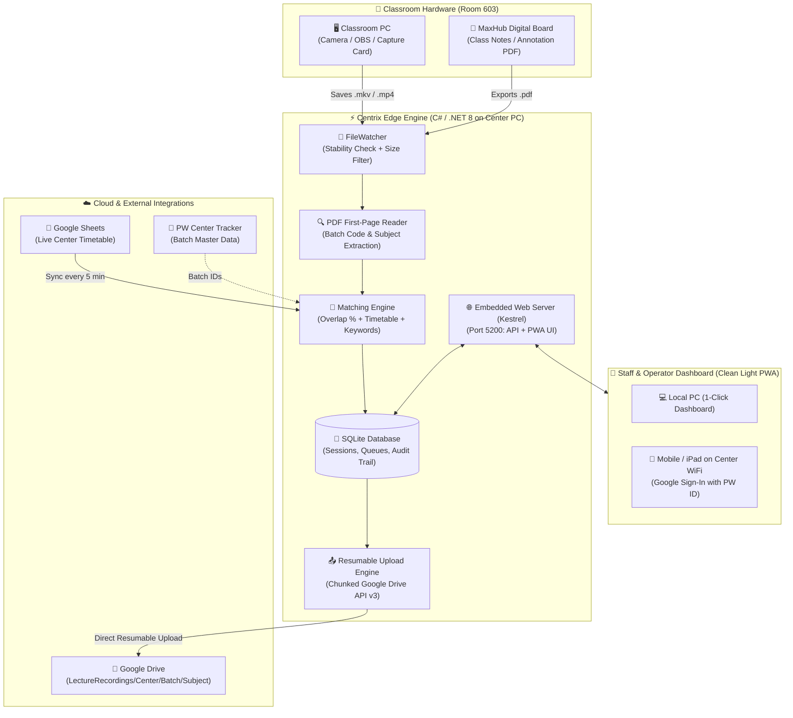

<div align="center">


# ⚡ Centrix

### **Autonomous Lecture Ingestion, Smart MaxHub Pairing & Direct-to-Drive Pipeline**

*The edge-first operations platform designed for 500+ Physics Wallah Vidyapeeth Centers — handling 10,000–20,000 daily lecture recordings with zero cloud storage bottlenecks.*

---

[](https://dotnet.microsoft.com/)
[](https://reactjs.org/)
[](https://www.typescriptlang.org/)
[](https://tailwindcss.com/)
[](https://www.sqlite.org/)
[](https://developers.google.com/drive)
[](https://developers.google.com/identity)
[](#)

[Overview](#-overview) • [Why Centrix?](#-why-centrix) • [Architecture](#-system-architecture) • [Smart Features](#-key-features) • [Classroom Setup](#-classroom-hardware-topology) • [Quick Start](#-quick-start-guide) • [Configuration](#-configuration-reference) • [API Contracts](#-api-endpoints-reference)

---

</div>

## 📖 Overview

In 500+ offline **Physics Wallah (PW) Vidyapeeth centers**, thousands of classrooms record lectures every single day. A typical class produces:
1. **High-Definition Video (`.mkv`, `.mp4`)** recorded from the classroom camera or PC capture card.
2. **Interactive Digital Notes (`.pdf`)** exported from the smart interactive flat panel (**MaxHub / Digital Board**).

Historically, center operators had to manually rename files, organize them into folders, match timetable batches, and upload gigabytes of data to Google Drive. This manual approach was error-prone, caused delay in releasing lectures to students, and suffered from network drops.

**Centrix** solves this end-to-end. It runs as a lightweight, resilient background agent directly on center PCs, automates detection, pairs videos with MaxHub notes, matches timetable slots using confidence scoring, performs resumable direct-to-Drive uploads, and provides center staff with a fast, mobile-friendly **1-tap review PWA dashboard**.

---

## 🎯 Why Centrix? (Design Philosophy)

```
┌──────────────────────────────────────────────────────────────────────────────────┐
│                             THE CENTRIX TRINITY                                  │
│                                                                                  │
│   🚀 MAXIMUM AUTOMATION        👥 MINIMUM OPERATOR TIME    💰 ZERO CLOUD EGRESS │
│   95%+ lectures auto-matched   Only 2-3 ambiguous cases    Files flow PC → Drive │
│   and uploaded hands-free      reviewed per day            Directly. $0 bandwidth│
└──────────────────────────────────────────────────────────────────────────────────┘
```

1. **Edge-First & Offline-Resilient**: All video processing, timetable indexing, and queue management happen locally using SQLite (WAL mode). Even during total internet outages, recording detection and queuing never stop.
2. **Zero Central Video Bottleneck**: Massive video files (2 GB to 8 GB each) are uploaded **directly from the classroom PC to Google Drive** via Google's chunked resumable upload protocol. Video data **never** touches a central proxy server, saving hundreds of thousands of dollars in cloud egress costs.
3. **Deterministic Multi-Layer Matching**: Rule-based confidence scoring (timetable schedule, file duration, time overlap, file keywords, and PDF first-page text inspection) decides assignments transparently before any fallback.
4. **Human-in-the-Loop when Needed**: If confidence is between $60\%$ and $84\%$, or if an emergency class occurred outside the timetable, Centrix routes the lecture to a clean 1-tap review queue for staff confirmation.
5. **Full Auditability**: Every single match, override, and rename is timestamped and logged in SQLite with revertibility.

---

## 🏗️ System Architecture



---

## ✨ Key Features

### 1. 🎥 Zero-Touch Lecture Ingestion
* **Real-time File System Watcher**: Continuously monitors the target recording directory.
* **Write Stability Detection**: Waits until OBS / recording software completely closes the file and file size stabilizes (prevents corrupt or partial uploads).
* **Smart Extension & Size Guard**: Ingests `.mkv`, `.mp4`, `.mov`, `.avi`, `.webm`, `.pdf`, `.pptx`, and `.ppt` while filtering out junk files below threshold (1 MB for video, 50 KB for PDF).

### 2. 📑 Smart MaxHub PDF & Video Pairing
* **Dual-Device Classrooms Supported**: Seamlessly pairs the camera recording from the PC with the lecture notes PDF exported from the MaxHub interactive flat panel.
* **First-Page PDF Text Extraction**: Automatically inspects the cover slide/page of the MaxHub PDF to extract batch names, subject codes, and teacher initials with zero manual typing.
* **Resilient to Handwritten / Canvas Notes**: Even when instructors write on a blank whiteboard with pen strokes (non-OCR vector drawings) or omit cover slides, Centrix binds the video and PDF into a unified session using strict room and temporal correlation.
* **Unified Destination**: Places both the video and the PDF in the exact same organized Google Drive hierarchy:
  ```
  LectureRecordings / <CenterName> / <BatchName> / <SubjectName> /
  ├── 2026-09-14_Physics_Kinematics_L04.mp4
  └── 2026-09-14_Physics_Kinematics_Notes.pdf
  ```

### 3. 🧠 Multi-Factor Confidence Matching Engine
Centrix uses a multi-factor weighted scoring formula to match files against scheduled timetable slots:

$$\text{Confidence} = w_1 \cdot S_{\text{time}} + w_2 \cdot S_{\text{overlap}} + w_3 \cdot S_{\text{duration}} + w_4 \cdot S_{\text{name}} + w_5 \cdot S_{\text{pdf}}$$

| Confidence Score | Engine Action | Operator Effort |
|---|---|---|
| **$\ge 85\%$** | **Auto-Approve & Enqueue** | None (Zero-Touch) |
| **$60\% - 84\%$** | **Route to Review Queue** with high-confidence recommendation | 1-Tap "Approve" on Mobile/PC |
| **$< 60\%$** | **Review Queue (Manual Override)** | Select Batch & Subject |
| **Duplicate Detected** | **Hold in Duplicate Safety Quarantine** | Prevents overwriting original class |

### 4. 🚀 Direct-to-Drive Resumable Upload Engine
* **Chunked Upload Protocol**: Uses the official Google Drive REST v3 resumable session API.
* **Network Interruption Recovery**: If center WiFi drops at 90% of a 4 GB file, Centrix resumes from the exact byte where it paused rather than re-uploading from scratch.
* **Exponential Backoff**: Configurable retries (e.g., 30s, 2m, 10m, 30m, 1h) to handle temporary ISP drops gracefully.

### 5. 🛡️ Physics Wallah Enterprise Security & Auth
* **Sign in with Google (PW Official ID)**: Staff login with their official `@pw.live` / Google Workspace account using standard OAuth 2.0.
* **1-Click Local PC Access**: When operating directly on the center PC (`localhost`), operators can jump straight to the dashboard with zero key-copying friction.
* **LAN Access Security**: Allows authorized staff on the center WiFi (tablets/phones) to review queues using the secure session token or optional access key.

### 6. ☀️ Clean Light Theme PWA Dashboard
* **Permanent Light Design**: Clean white cards, crisp slate borders, readable typography, and high-contrast Physics Wallah branding.
* **Official PW Logo Integration**: Crystal-clear display of the official PW emblem across all screen sizes.
* **Live Feed & Progress**: Real-time progress bars and status indicators for files in transit.
* **Timetable Editor & Emergency Slots**: Add extra lectures, cancel slots for holidays, or swap subjects on the fly without touching backend files.
* **Center Multi-Room Overview**: Monitor all room agents in the building from a single master screen.

### 7. 🛡️ Unscheduled, Blank-Timetable & Surprise Lecture Resilience
* **Zero-Guesswork Anti-Corruption Quarantine**: When an unexpected lecture takes place on an off-day (e.g., Saturday test discussions, Sunday doubt clinics) or when a teacher conducts an unannounced class without a timetable entry, Centrix **strictly avoids blind uploads**. If no batch destination can be verified with high confidence, the upload is held in safe local storage rather than misrouting files to arbitrary folders.
* **Hardware & Temporal Session Bonding**: Even when notes are entirely handwritten (vector pen strokes) and the timetable is empty, the system pairs the MP4 video and exported PDF by verifying identical `RoomId`, `DeviceId`, and concurrent recording/export time windows.
* **1-Tap Operator Confirmation**: Ambiguous and unscheduled recordings immediately populate the mobile/desktop **Review Queue** with detected metadata (Room, Start/End time, duration, file sizes). Center staff select the target Batch & Subject in 5 seconds to instantly dispatch both files to their correct Google Drive destination.
* **Emergency Slot Ingestion**: If an extra lecture is planned in advance, operators can register an "Extra Lecture" override through the Timetable Editor in 2 clicks, converting the session into a 100% automated zero-touch ingestion.

---

## 🏫 Classroom Hardware Topology

Centrix accommodates the two standard classroom hardware layouts deployed across Vidyapeeth centers:

### Layout A: Single PC (Integrated Camera & Display)
```
[ Classroom PC ] 
  ├── Captures Camera / Audio (OBS / Centrix-monitored folder)
  ├── Saves MaxHub PDF to same local folder
  └── Centrix uploads both directly to Drive
```

### Layout B: Dual Hardware (MaxHub Digital Board + Separate PC)
```
[ MaxHub Smartboard ] ──(Saves PDF to LAN Shared Folder)──┐
                                                           ▼
[ Camera Recording PC ] ──(Saves Video locally)──▶ [ Centrix Agent ] ──▶ [ Google Drive ]
```
> [!TIP]
> To link a MaxHub panel with Centrix, simply set the MaxHub's default export directory to a shared folder on the PC, or point Centrix's `MonitorFolder` to the shared drive path.

---

## 🚀 Quick Start Guide

### Prerequisites
* **Runtime**: [.NET 8.0 SDK / Runtime](https://dotnet.microsoft.com/download/dotnet/8.0)
* **Frontend**: [Node.js 18+](https://nodejs.org/) (for building web dashboard)
* **Optional**: `ffmpeg` / `ffprobe` (for deep video stream duration inspection)
* **Google Credentials**: `config/google_credentials.json` (Service Account or OAuth Client for Drive API)

---

### Step 1: Clone the Repository
```bash
git clone https://github.com/aniketmishra-0/Centrix.git
cd Centrix
```

### Step 2: Build the Web Dashboard (PWA)
```bash
cd web
npm install
npm run build
cd ..
```
*This compiles the React 18 TypeScript application into `agent/src/LectureAgent/wwwroot/`.*

### Step 3: Run Centrix Agent
Run the helper startup script with your target recordings directory:
```bash
# Syntax: ./scripts/run-agent.sh "<Folder-to-Watch>" "<Root-Drive-Folder>"
./scripts/run-agent.sh "/Users/Lectures" "LectureRecordings"
```

The terminal will launch Centrix and print:
```text
============================================================
  CENTRIX — PW Lecture Operations Engine
============================================================
  Monitored Folder:  /Users/Lectures
  Drive Root:        LectureRecordings
  Local Dashboard:   http://localhost:5200/
  Network (WiFi):    http://192.168.1.38:5200/
============================================================
```

### Step 4: Open Dashboard
* Open **`http://localhost:5200`** in your browser.
* Click **"Continue to Dashboard (Local PC)"** or **"Sign in with Google (PW ID)"**.
* Drop any `.mp4` or `.pdf` file into your monitored folder to see Centrix detect, match, and sync it live!

---

## ⚙️ Configuration Reference

Centrix is configured via `agent/src/LectureAgent/appsettings.json`:

```json
{
  "Agent": {
    "OrganizationId": "PCMC_VIDYAPEETH",
    "CenterId": "Pune - PCMC Vidyapeeth",
    "RoomId": "603",
    "DeviceId": "PC-ROOM-603"
  },
  "FileWatcher": {
    "MonitorFolder": "D:/Lectures",
    "EnableFileWatcher": true,
    "StabilityCheckMs": 2000,
    "MaxFileAgeHours": 24,
    "FileExtensionsToMonitor": ".mkv,.mp4,.mov,.avi,.webm,.pdf,.pptx,.ppt"
  },
  "Matching": {
    "HighConfidenceThreshold": 85,
    "MediumConfidenceThreshold": 60,
    "TimeOverlapMinimumPercentage": 50,
    "TimeToleranceMinutes": 15,
    "DurationToleranceMinutes": 10
  },
  "UploadQueue": {
    "MaxConcurrentUploads": 3,
    "QueueUnmatchedFiles": true,
    "UploadCheckIntervalSeconds": 30,
    "MaxRetries": 5,
    "RetryBackoffSeconds": "30,120,600,1800,3600"
  },
  "GoogleDrive": {
    "Enabled": true,
    "CredentialsPath": "config/google_credentials.json",
    "TokenPath": "data/google-drive-token",
    "RootFolderPath": "LectureRecordings",
    "MaxUploadSizeBytes": 1099511627776
  },
  "GoogleSheet": {
    "SpreadsheetId": "1XOfPQ6IqtKXJtG9l7b9JALBNKl8DKbJvlyLnbp5MCCc",
    "SyncIntervalMinutes": 5
  },
  "TrackerMapping": {
    "Enabled": true,
    "BaseUrl": "https://pw-center-tracker-backend.betterpw.live/api/v1"
  },
  "Auth": {
    "Enabled": false,
    "ApiKey": "f6a62b234f4d336326d2c0b2bf162fcc77080adaa6713374"
  }
}
```

### Key Parameter Breakdown

| Section | Key | Description | Default |
|---|---|---|---|
| **`Agent`** | `CenterId` | Human-readable name of the Vidyapeeth center | `"Pune - PCMC"` |
| | `RoomId` | Room identifier for timetable matching | `"603"` |
| **`FileWatcher`** | `MonitorFolder` | Local directory where OBS / MaxHub saves recordings | `"D:/Lectures"` |
| | `StabilityCheckMs` | Milliseconds file size must remain constant before ingestion | `2000` |
| **`Matching`** | `HighConfidenceThreshold` | Score threshold ($\ge$) for auto-upload without human review | `85` |
| | `MediumConfidenceThreshold` | Score threshold ($\ge$) for suggested match in review queue | `60` |
| **`UploadQueue`** | `MaxConcurrentUploads` | Maximum simultaneous uploads to Google Drive | `3` |
| **`GoogleDrive`** | `CredentialsPath` | Path to Google OAuth client secret or Service Account JSON | `"config/google_credentials.json"` |
| **`GoogleSheet`** | `SpreadsheetId` | Central Google Sheet ID containing daily master timetable | `"<PW-Sheet-Id>"` |
| | `SyncIntervalMinutes` | Background sync cadence for timetable updates | `5` |

---

## 📡 API Endpoints Reference

The embedded Kestrel server exposes full control to the dashboard and integrations:

### 🔍 System Health & Agent Info
* `GET /health` — Quick liveness probe (Database status, Uptime).
* `GET /api/agent/info` — Device ID, Center/Room info, Monitored folder, LAN IPs.

### 🔐 Authentication & Session
* `GET /api/auth/config` — Checks if Google OAuth is enabled and configured.
* `POST /api/auth/google/start` — Starts Google sign-in flow and returns consent URL.
* `GET /api/auth/google/poll/{flowId}` — Polls status of ongoing Google sign-in.
* `GET /api/auth/google/callback` — Google OAuth redirect handler.

### 📊 Lecture Queue & Reviews
* `GET /api/lectures?centerId={id}&limit=30` — List recent lecture sessions.
* `POST /api/lectures/{id}/confirm` — Operator approves a suggested match.
* `POST /api/lectures/{id}/override` — Operator re-assigns batch or subject manually.
* `POST /api/lectures/{id}/rematch` — Re-triggers matching engine against fresh timetable.
* `POST /api/lectures/{id}/force-enqueue` — Forces upload of duplicate or unmatched file.

### 📅 Timetable & Overrides
* `GET /api/timetable?centerId={id}&roomId={room}` — Fetch today's local timetable slots.
* `POST /api/timetable` — Add custom slot or emergency lecture.
* `POST /api/timetable/cancel` — Cancels a specific timetable slot for today only.
* `GET /api/timetable/overrides` — Lists active overrides for the center.
* `POST /api/timetable/overrides/{id}/deactivate` — Reverts an override.

### 🎮 Runtime Engine Controls
* `GET /api/control/state` — Real-time state of uploads, watcher, and sheet sync.
* `POST /api/control/uploads/pause|resume` — Pauses or resumes upload queue processing.
* `POST /api/control/uploads/retry-failed` — Retries all failed uploads immediately.
* `POST /api/control/monitoring/pause|resume` — Pauses or resumes directory watcher.
* `POST /api/control/monitoring/rescan` — Scans folder for untracked existing files.
* `POST /api/control/timetable/sync` — Forces immediate pull from Google Sheets.

---

## 📂 Repository Structure

```
Centrix/
├── agent/                         # C# / .NET 8 Backend
│   ├── src/
│   │   ├── LectureAgent/          # Web API, Kestrel Host, Background Workers
│   │   │   ├── Controllers/       # REST API endpoints (Auth, Lectures, Timetable, Control)
│   │   │   ├── Security/          # API Key Middleware & Google Session Verification
│   │   │   ├── Services/          # Upload Processing, File Monitoring, Sheet Sync
│   │   │   └── wwwroot/           # Compiled React PWA dashboard (static assets)
│   │   ├── LectureAgent.Application/  # Core business logic, Handlers, Matching logic
│   │   ├── LectureAgent.Domain/       # Entities, Interfaces, State Machine Enums
│   │   └── LectureAgent.Infrastructure/ # SQLite DB, Drive API, File System Watcher
├── web/                           # Modern React 18 TypeScript Dashboard
│   ├── src/
│   │   ├── screens/
│   │   │   ├── Login.tsx          # Google Sign-In & 1-Click Local Access Screen
│   │   │   ├── Live.tsx           # Live Upload Feed, Progress Bars, Queue Metrics
│   │   │   ├── Review.tsx         # 1-Tap Review Queue & Duplicate Safety Holds
│   │   │   ├── Schedule.tsx       # Timetable Timeline & Emergency Slot Adder
│   │   │   ├── Center.tsx         # Multi-Room Overview Dashboard
│   │   │   └── Controls.tsx       # Remote Switches (Pause/Resume, Rescan, Retry)
│   │   ├── ui.tsx                 # Clean Light Theme UI Component System
│   │   ├── api.ts                 # Type-safe API client
│   │   ├── config.ts              # Session Token & Connection Manager
│   │   └── App.tsx                # Dashboard Shell, Navigation & Modals
│   ├── public/                    # PWA Manifest & Official PW Logo (logo.png)
│   └── vite.config.ts             # Vite build configuration
├── installer/                     # Windows Setup Wizard & Service InnoSetup scripts
├── scripts/                       # Automation scripts
│   ├── run-agent.sh               # 1-Click launcher for macOS / Linux
│   ├── build-web.sh               # Builds React PWA into agent wwwroot
│   └── publish-cross-platform.sh  # Builds self-contained binaries for Win/Mac/Linux
└── docs/                          # Comprehensive System Documentation
    ├── ARCHITECTURE.md            # Detailed internal architecture
    ├── MATCHING_ENGINE_SPEC.md    # Confidence scoring math & algorithms
    ├── DATABASE_SCHEMA.md         # SQLite entity schemas
    └── GUIDE.md                   # Operator operational manual
```

---

## ❓ Frequently Asked Questions (FAQ)

<details>
<summary><b>1. What happens if the center internet goes down during an upload?</b></summary>
Centrix utilizes Google Drive's chunked resumable upload protocol. The local SQLite database tracks the exact bytes committed. When the internet connection returns, Centrix resumes the upload from the exact byte where it dropped, with zero data loss and without re-uploading from 0%.
</details>

<details>
<summary><b>2. Why are videos not sent to a central cloud server first?</b></summary>
With 500+ centers generating 10,000–20,000 multi-gigabyte recordings every day, centralizing video streams would require massive cloud network bandwidth, petabytes of temporary storage, and astronomical egress costs. Uploading directly from the center PC to Google Drive leverages the center's local fiber connection directly to Google's backbone for $0 cloud egress.
</details>

<details>
<summary><b>3. How does Centrix avoid uploading duplicate files?</b></summary>
When a file is detected, Centrix checks if a lecture session for the same room and slot has already been uploaded today. If an uploaded lecture exists, Centrix places the new file into a <code>Duplicate Hold</code> state in the Review tab. It will never overwrite existing Drive files unless an operator explicitly clicks "Upload Anyway".
</details>

<details>
<summary><b>4. How does the MaxHub PDF pairing work?</b></summary>
In rooms with a MaxHub interactive board, the teacher exports their notes as a PDF. Centrix inspects the first page text using its PDF reader to extract the batch title and subject, and pairs it with the camera video recorded in the same time window, grouping both files into the same batch folder in Google Drive.
</details>

<details>
<summary><b>5. How does Centrix handle unscheduled classes or blank timetables (e.g., Saturdays / surprise classes)?</b></summary>
When a teacher conducts a lecture on an off-day (such as Saturday) or enters a room unannounced on a weekday when no timetable slot is scheduled, Centrix's <b>Zero-Guesswork Safety Policy</b> activates:
<ul>
  <li><b>No Blind Uploads:</b> The system refuses to push files to arbitrary Drive folders if the destination batch cannot be verified with high confidence.</li>
  <li><b>Dual File Bonding:</b> The camera video recording and exported notes PDF are automatically grouped together into a single session based on identical <code>RoomId</code>, <code>DeviceId</code>, and matching start/end timestamps.</li>
  <li><b>1-Tap Review Queue:</b> The session is immediately routed to the center dashboard's Review Queue labeled as <code>EXTRA_LECTURE</code>. The center operator or coordinator simply selects the Batch & Subject from a dropdown and taps <i>Confirm</i>. Both video and notes are instantly dispatched to the correct Google Drive folder.</li>
  <li><b>Pre-Emptive Override:</b> If the class is known in advance, center staff can add an <i>Extra Slot</i> in the Timetable Editor, allowing Centrix to match and upload the lecture with 100% zero-touch automation.</li>
</ul>
</details>

<details>
<summary><b>6. What happens if the teacher writes notes by hand on MaxHub without a printed cover slide?</b></summary>
Teachers often write notes using interactive pen tools on a blank canvas, producing vector line strokes rather than OCR/font-based digital text. In such cases:
<ul>
  <li>The PDF text extractor safely reports zero textual hints without throwing exceptions or corrupting data.</li>
  <li>Because room hardware mapping (<code>RoomId</code>) and recording time windows remain strictly identical between the PC's video recording and the board's PDF export, the two files remain firmly paired.</li>
  <li>The session transitions to <code>Review Required</code> or <code>Extra Lecture</code>. An operator verifies the batch in 5 seconds via the mobile/desktop Review Queue, ensuring 100% upload accuracy without relying on handwriting recognition.</li>
</ul>
</details>

---

## 👥 Engineering & Support

* **Organization**: Physics Wallah Vidyapeeth Operations & Tech Team
* **Platform**: Centrix Edge Operations Platform
* **Repository**: [github.com/aniketmishra-0/Centrix](https://github.com/aniketmishra-0/Centrix)
* **Version**: `2.0.0-production`

---

<div align="center">
  <sub>Built with ❤️ for Physics Wallah Vidyapeeth Centers across India.</sub>
</div>
