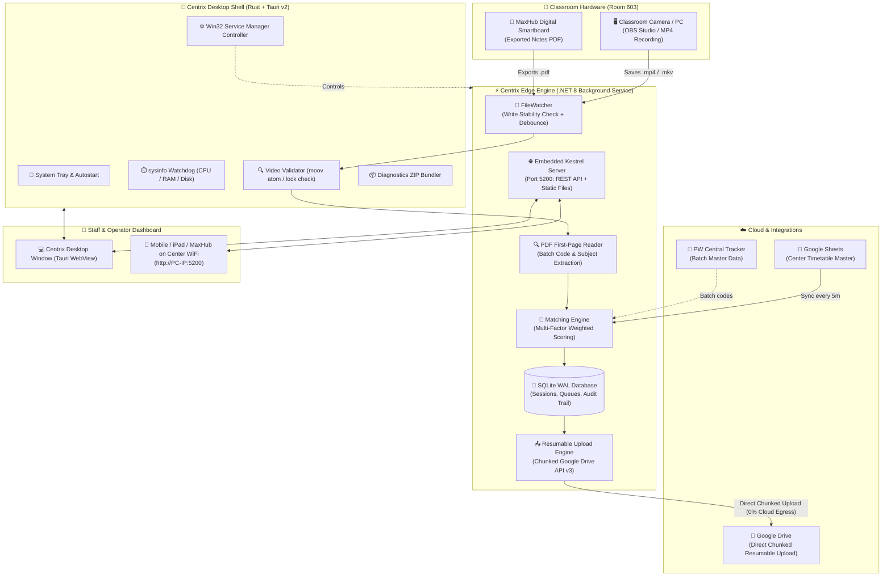

<div align="center">


# ⚡ Centrix (Rust + .NET 8)

### **Autonomous Lecture Ingestion, Smart MaxHub Pairing & Direct-to-Drive Pipeline**

*The edge-first operations platform designed for 500+ Physics Wallah Vidyapeeth Centers — handling 10,000–20,000 daily lecture recordings with zero cloud storage bottlenecks.*

---

[](https://www.rust-lang.org/)
[](https://v2.tauri.app/)
[](https://dotnet.microsoft.com/)
[](https://reactjs.org/)
[](https://www.typescriptlang.org/)
[](https://tailwindcss.com/)
[](https://www.sqlite.org/)
[](https://developers.google.com/drive)
[](#)

[Overview](#-overview) • [Why Centrix?](#-why-centrix-design-philosophy) • [Tech Stack Deep-Dive](#-tech-stack-deep-dive-kaise-kya-use-hua-hai) • [Architecture](#-system-architecture) • [Step-by-Step Installation](#-step-by-step-installation-guide-kaise-install-krna-hai) • [Classroom Hardware Setup](#-classroom-hardware-topology) • [Configuration](#-configuration-reference) • [API & IPC Contracts](#-api--ipc-contracts-reference) • [FAQ & Edge Cases](#-frequently-asked-questions--edge-cases) • [Repository Map](#-detailed-directory-structure)

---

</div>

## 📖 Overview

In 500+ offline **Physics Wallah (PW) Vidyapeeth centers** across India, thousands of smart classrooms conduct high-stakes JEE and NEET lectures every day. A single class session produces two vital artifacts:
1. **High-Definition Video Recording (`.mkv`, `.mp4`)**: Captured from the classroom camera via OBS Studio or capture cards.
2. **Interactive Digital Notes (`.pdf`)**: Exported from the smart interactive flat panel (**MaxHub / Digital Smartboard**).

### The Real-World Challenge:
Historically, center operators had to manually rename files, organize them into folders, match timetable batches, and upload gigabytes of data to Google Drive. This manual workflow suffered from:
- **Human Error**: Misnaming files or uploading Physics lectures into Chemistry folders.
- **Delay in Student Access**: Lectures took 12–24 hours to reach student dashboards.
- **Network Failures**: Large uploads (3 GB – 8 GB) dropped mid-way on center broadband, forcing operators to start from 0%.
- **Cloud Egress Prohibitive Cost**: Routing thousands of multi-gigabyte videos through a central cloud backend would cost hundreds of thousands of dollars in server bandwidth every month.

### The Centrix Solution:
**Centrix** is an edge-first, autonomous ingestion platform. Powered by an ultra-lightweight **Rust (Tauri v2)** desktop shell and a robust **.NET 8** background agent, it runs locally on center PCs:
- Automatically detects new recordings when OBS stops writing.
- Pairs camera video with MaxHub digital board PDF notes.
- Uses multi-factor confidence scoring to match the lecture with scheduled timetable slots.
- Uploads directly from the classroom PC to Google Drive using chunked resumable streaming (saving 100% cloud egress).
- Provides center staff with a mobile/desktop 1-tap review dashboard.

---

## 🎯 Why Centrix? (Design Philosophy)

```
┌────────────────────────────────────────────────────────────────────────────────────────┐
│                                 THE CENTRIX TRINITY                                    │
│                                                                                        │
│   🚀 MAXIMUM AUTOMATION          👥 MINIMUM OPERATOR TIME      💰 ZERO CLOUD EGRESS   │
│   95%+ lectures auto-matched     Only 2-3 ambiguous cases      Files flow PC → Drive  │
│   and uploaded hands-free        reviewed per day in 1 tap     Directly. $0 bandwidth │
└────────────────────────────────────────────────────────────────────────────────────────┘
```

1. **Edge-First & Offline-Resilient**: All video processing, timetable indexing, and queue management happen locally using SQLite (Write-Ahead Logging mode). Even during total internet outages, recording detection and queuing never stop.
2. **Zero Central Video Bottleneck**: Massive video files (2 GB to 8 GB each) are uploaded **directly from the classroom PC to Google Drive** via Google's chunked resumable upload protocol. Video data **never** touches a central proxy server.
3. **Deterministic Multi-Layer Matching**: Rule-based confidence scoring (timetable schedule, file duration, time overlap, file keywords, and PDF first-page text inspection) decides assignments transparently before any fallback.
4. **Human-in-the-Loop when Needed**: If confidence is between $60\%$ and $84\%$, or if an emergency class occurred outside the timetable, Centrix routes the lecture to a clean 1-tap review queue for staff confirmation.
5. **Full Auditability**: Every single match, override, and rename is timestamped and logged in SQLite with revertibility.

---

## 🔬 Tech Stack Deep-Dive ("Kaise Kya Use Hua Hai")

Centrix is split into three tightly integrated layers: the **Rust Desktop Shell**, the **.NET 8 Edge Engine**, and the **React 18 PWA Frontend**.

```
┌────────────────────────────────────────────────────────────────────────────────────────┐
│                                   CENTRIX ECOSYSTEM                                    │
├──────────────────────────────┬──────────────────────────────┬──────────────────────────┤
│    Desktop Shell (Rust)      │   Edge Engine (C# .NET 8)    │   Dashboard UI (React)   │
├──────────────────────────────┼──────────────────────────────┼──────────────────────────┤
│ • Tauri v2 Framework         │ • C# 12 / .NET 8 LTS         │ • React 18 + TypeScript  │
│ • Win32 Service Manager API  │ • Kestrel Embedded Web Host  │ • Vite Build Tooling     │
│ • sysinfo System Watchdog    │ • SQLite (WAL Mode) + Dapper │ • Tailwind CSS UI        │
│ • Native File & Video I/O    │ • Google Drive API v3 (REST) │ • Lucide React Icons     │
│ • Auto-Start & Tray Daemon   │ • PdfPig PDF Text Extractor  │ • Tauri IPC Client       │
│ • Diagnostic ZIP Bundler     │ • Google Sheets Sync Engine  │ • Mobile PWA Manifest    │
└──────────────────────────────┴──────────────────────────────┴──────────────────────────┘
```

---

### Layer 1: Rust Desktop Shell (`web/src-tauri/`)

Why Rust & Tauri v2?
Traditional desktop apps built on Electron consume 150MB–200MB installer size and 200MB–500MB of RAM idle. In classroom PCs running heavy OBS recording and screen capture cards simultaneously, every megabyte of RAM matters.
By choosing **Tauri v2 + Rust**:
- **Installer Size**: Reduced from 200MB to **~15MB - 25MB**.
- **Memory Footprint**: Idle memory is **< 30MB**.
- **Native OS Control**: Unrestricted direct access to Windows Services, Win32 APIs, file locks, and hardware sensors with zero native wrapper lag.

#### Rust Modules Breakdown:

| Module | Source File | Purpose & How It Works |
|---|---|---|
| **Entrypoint & Window** | [`src/main.rs`](file:///Users/aniketmishra/Desktop/Centrix/web/src-tauri/src/main.rs) | Sets up Tauri plugins (single-instance lock, dialog, notification, shell, autostart). Prevents window destruction on close (minimizes to tray instead). Handles `--minimized` boot flag. |
| **Windows Service Control** | [`src/service.rs`](file:///Users/aniketmishra/Desktop/Centrix/web/src-tauri/src/service.rs) | Directly interacts with Windows Service Control Manager (`advapi32.dll` / Win32 API). Starts, stops, restarts, checks status, and registers `LectureAgent` as a persistent Windows Service without running external batch files. |
| **Hardware Health Watchdog** | [`src/health.rs`](file:///Users/aniketmishra/Desktop/Centrix/web/src-tauri/src/health.rs) | Uses the `sysinfo` crate to query live CPU core utilization %, total and available RAM, and target disk mount point free space. Alerts operators if recording disk space falls below safety thresholds. |
| **Diagnostics Bundler** | [`src/diagnostics.rs`](file:///Users/aniketmishra/Desktop/Centrix/web/src-tauri/src/diagnostics.rs) | Automatically gathers application logs, database snapshots, agent configuration, and hardware state into a timestamped `.zip` archive on the Desktop for 1-click support troubleshooting. |
| **Video Integrity Validator** | [`src/video_validator.rs`](file:///Users/aniketmishra/Desktop/Centrix/web/src-tauri/src/video_validator.rs) | Inspects video files directly on disk. Checks whether the file is locked by OBS, validates file size thresholds, and verifies container headers (detects missing MP4 `moov` atoms or corrupt MKV blocks before queuing for upload). |
| **Fast Video Thumbnails** | [`src/video_thumbnail.rs`](file:///Users/aniketmishra/Desktop/Centrix/web/src-tauri/src/video_thumbnail.rs) | Generates fast visual preview frames from recorded videos so operators can visually verify classroom content directly in the Review Queue without opening heavy media players. |
| **Smart Bandwidth Limiter** | [`src/bandwidth.rs`](file:///Users/aniketmishra/Desktop/Centrix/web/src-tauri/src/bandwidth.rs) | Configures upload rate limits (Mbps) and schedules off-peak upload hours (e.g. night 8:00 PM – 8:00 AM) to ensure daytime center teaching and student testing bandwidth remain unhindered. |
| **System Tray Daemon** | [`src/tray.rs`](file:///Users/aniketmishra/Desktop/Centrix/web/src-tauri/src/tray.rs) | Houses the persistent system tray icon with quick options (Open Dashboard, Restart Service, Service Status, and Exit). |
| **Path & Settings Bridge** | [`src/settings.rs`](file:///Users/aniketmishra/Desktop/Centrix/web/src-tauri/src/settings.rs) | Reads and updates `appsettings.json` in `C:\ProgramData\Centrix`, generates cryptographically secure API keys via `rand` / `hex`, and returns canonical system paths. |

---

### Layer 2: Edge Ingestion Engine (`agent/src/`)

Built on **C# 12 and .NET 8 LTS**, this engine runs as a robust background service:

#### Project Architecture Breakdown:
- **`LectureAgent.Domain`**: Clean Architecture core. Contains domain entities (`LectureSession`, `TimetableSlot`, `RecordingFile`, `AuditLog`), domain interfaces, and state machine enums (`ProcessingStatus`, `UploadStatus`, `MatchConfidence`).
- **`LectureAgent.Application`**: Orchestration logic, DTOs, request handlers, and timetable reconciliation algorithms.
- **`LectureAgent.Infrastructure`**:
  - **File Watching (`FileWatcherService.cs`)**: Watches recording directories with debounced stability timers (waits until file size stops growing for 2000ms, ensuring OBS has finished writing).
  - **MaxHub PDF Reader (`PdfFirstPageReader.cs`)**: Parses the cover slide of exported MaxHub digital board PDFs using `PdfPig` to extract batch codes, subject names, and faculty details.
  - **Confidence Matching Engine (`MatchingEngine.cs`)**: Multi-factor scoring engine matching files to scheduled slots.
  - **Chunked Resumable Uploader (`GoogleDriveUploader.cs`)**: Interacts directly with Google Drive REST API v3. Uploads large files in 8MB–16MB chunks with byte-range validation and exponential backoff retry.
  - **SQLite Database (`DatabaseContext.cs`)**: High-performance local storage with Write-Ahead Logging (WAL) enabled, preventing write contention between watcher, upload worker, and API.
  - **Timetable Sync (`GoogleSheetTimetableSync.cs`)**: Periodically pulls master schedules from center Google Sheets and the PW Central Tracker backend.
- **`LectureAgent` (Web API & Host)**:
  - ASP.NET Core Kestrel server running on port `5200`.
  - Exposes REST endpoints for local and LAN communication.
  - Hosts the embedded static React PWA dashboard (`wwwroot`).
  - Implements Google OAuth 2.0 PKCE login and DPAPI security for credentials.

---

### Layer 3: React 18 + TypeScript PWA Dashboard (`web/src/`)

A responsive, high-contrast, clean light-themed interface tailored for classroom operators and mobile tablet use:
- **`App.tsx`**: Main application shell, routing, live navigation, and modal controllers.
- **`tauri.ts`**: Unified bridge providing auto-detection: runs as native Tauri desktop IPC when inside the desktop shell, and falls back gracefully to standard REST API when accessed over LAN via mobile browser.
- **`screens/SetupWizard.tsx`**: First-time onboarding wizard guiding the operator through folder selection, Google OAuth authorization, and classroom room ID configuration.
- **`screens/Live.tsx`**: Real-time upload queue, progress percentage meters, upload speed counters, and 24-hour upload timeline.
- **`screens/Review.tsx`**: The 1-tap review queue displaying confidence scores, video thumbnail previews, file integrity alerts, and quick batch assignment dropdowns.
- **`screens/Schedule.tsx`**: Full timetable schedule view with emergency extra lecture creation, room filtering, and slot cancellation.
- **`screens/StudioLive.tsx`**: Studio-friendly fullscreen monitor showing current recording timer, MaxHub pairing status, and upload readiness.
- **`screens/Controls.tsx`**: Central command deck with native Windows service switches (Start/Stop/Restart), CPU/RAM/Disk live graphs, bandwidth settings, and 1-click diagnostic export.
- **`screens/Center.tsx`**: Center-wide multi-room monitoring dashboard for center managers.
- **`screens/Login.tsx`**: Google Sign-In with official `@pw.live` domain authentication and 1-click local PC access bypass.

---

## 🏗️ System Architecture



---

## 🧠 Multi-Factor Confidence Matching Engine

When a recording is detected, Centrix calculates a weighted confidence score ($0\% - 100\%$) against today's timetable slots:

$$\text{Confidence Score} = w_1 \cdot S_{\text{time}} + w_2 \cdot S_{\text{overlap}} + w_3 \cdot S_{\text{duration}} + w_4 \cdot S_{\text{name}} + w_5 \cdot S_{\text{pdf}}$$

Where the scoring factors are:
1. **$S_{\text{time}}$ (Start Time Proximity)**: Difference between recording start time and timetable scheduled slot.
2. **$S_{\text{overlap}}$ (Time Window Overlap %)**: Percentage of recording duration that falls within scheduled lecture window.
3. **$S_{\text{duration}}$ (Duration Consistency)**: Compares actual video length against expected lecture length (typically 90–120 minutes).
4. **$S_{\text{name}}$ (Filename Keywords)**: Checks if OBS filename includes batch codes (e.g. `TY26`, `NEET`, `PHY`).
5. **$S_{\text{pdf}}$ (MaxHub PDF Extraction)**: Scans the PDF first slide for batch title and subject name.

### Action Matrix:

| Confidence Score | Engine Action | Operator Effort | Target Google Drive Destination |
|:---:|:---:|:---:|:---:|
| **$\ge 85\%$** | **Auto-Approved & Queued** | Zero (100% Autonomous) | `LectureRecordings/<Center>/<Batch>/<Subject>/` |
| **$60\% - 84\%$** | **Suggested in Review Queue** | 1-Tap "Approve" | Confirmed destination upon 1 tap |
| **$< 60\%$** | **Manual Review Required** | Select Batch from Dropdown | User-selected batch folder |
| **Duplicate Detected** | **Duplicate Safety Hold** | Click "Upload Anyway" or Discard | Prevents overwriting original class |

---

## 🚀 Step-by-Step Installation Guide ("Kaise Install Krna Hai")

Centrix can be installed in three different ways depending on your environment:

---

### Method A: Single-File Desktop Installer (Recommended for Center PCs)

> [!TIP]
> **Zero Prerequisites Required**: You do **NOT** need to install Node.js, Rust, Python, or .NET 8 on classroom PCs. The installer is fully self-contained.

#### Step 1: Download / Copy Installer
Copy `Centrix-Setup-1.0.0.exe` (or `LectureAgent-Setup.exe`) to the classroom PC via pendrive, local network share, or Google Drive.

#### Step 2: Run Setup
Double-click `Centrix-Setup-1.0.0.exe`.
The installer performs the following operations automatically:
- Extracts application files to `C:\ProgramData\Centrix\`.
- Registers the `LectureAgent` Windows Background Service.
- Creates Desktop and Start Menu shortcuts.
- Configures Windows Firewall to allow port `5200` for center LAN dashboard access.
- Launches the **Centrix Desktop Application**.

#### Step 3: Complete Onboarding Setup Wizard
When the Centrix window appears, follow the 4-step wizard:
1. **Monitored Directory**: Select the folder where OBS or the classroom camera saves recordings (e.g., `D:\Lectures` or `C:\Users\Admin\Videos`).
2. **Center Details**: Enter your Center Name (e.g., `Pune - PCMC Vidyapeeth`) and Room Number (e.g., `603`).
3. **Google Drive Connection**: Click **"Connect Google Drive"** to authorize with the center's Google Workspace account (see [Google Drive Authorization](#-google-drive-connection--authorization)).
4. **Finish & Start**: Click **"Start Engine"**. The agent begins 24x7 monitoring immediately.

---

### Method B: Building from Source (Developers & DevOps)

If you wish to compile Centrix from the source repository:

#### 1. Prerequisites:
- **Rust Toolchain**: [rustup.rs](https://rustup.rs/) (edition 2021+)
- **.NET 8 SDK**: [.NET 8.0 SDK](https://dotnet.microsoft.com/download/dotnet/8.0)
- **Node.js**: [Node.js 18+](https://nodejs.org/) (LTS recommended)
- **Git**: Git installed on your system

#### 2. Clone the Repository:
```bash
git clone https://github.com/aniketmishra-0/Centrix_rust.git
cd Centrix_rust
```

#### 3. Build the React Frontend:
```bash
cd web
npm install
npm run build
cd ..
```
*This compiles the Vite TypeScript application into `agent/src/LectureAgent/wwwroot/` and `web/dist/`.*

#### 4. Build & Publish the .NET 8 Edge Agent:
```bash
# Windows x64 self-contained build:
dotnet publish agent/src/LectureAgent/LectureAgent.csproj \
  --configuration Release \
  -r win-x64 \
  --self-contained true \
  --output web/src-tauri/resources/agent

# Or for macOS (Apple Silicon ARM64):
dotnet publish agent/src/LectureAgent/LectureAgent.csproj \
  --configuration Release \
  -r osx-arm64 \
  --self-contained true \
  --output web/src-tauri/resources/agent
```

#### 5. Run Centrix in Development Mode:
```bash
cd web
npm run tauri dev
```
*This launches the native desktop window with hot-reload enabled for both Rust IPC and React UI.*

#### 6. Build the Final Production Installer:
```bash
# Using the automated build script:
./scripts/build-tauri-installer.sh

# Or directly via Tauri CLI:
cd web
npx tauri build
```
*Output installer will be generated at:*  
`web/src-tauri/target/release/bundle/nsis/Centrix-Setup_1.0.0_x64-setup.exe`

---

### Method C: Headless / Background Service Mode (Server / Mac / Linux)

To run Centrix without the desktop UI on a dedicated recording server or non-Windows machine:

```bash
# On macOS / Linux:
./scripts/run-agent.sh "/path/to/recordings" "LectureRecordings"

# Or directly via dotnet:
cd agent/src/LectureAgent
dotnet run --configuration Release
```

The Kestrel server will start and display:
```text
============================================================
  CENTRIX — PW Lecture Operations Engine
============================================================
  Monitored Folder:  /path/to/recordings
  Drive Root:        LectureRecordings
  Local Dashboard:   http://localhost:5200/
  Network (WiFi):    http://192.168.1.77:5200/
============================================================
```

---

## ☁️ Google Drive Connection & Authorization

Centrix uploads directly into pre-existing batch folders on Google Drive without routing through central proxies.

### One-Time OAuth 2.0 Authorization:
1. The OAuth client credentials file (`config/google_credentials.json`) is included.
2. The **first time** you start the agent, or when clicking **"Authorize Google Drive"** in the Setup Wizard / Controls screen:
   - A Google Sign-In prompt opens in your browser.
   - Log in using the **Center's Official Google Account** (where lecture recording Drive folders are hosted).
   - Click **Allow** to grant Google Drive file upload permissions.
3. The authorization tokens (access token and refresh token) are encrypted and saved locally in `data/google-drive-token`.
4. **No Re-Authentication Needed**: The engine automatically refreshes expired access tokens in the background without disturbing operators.

---

## 🏫 Classroom Hardware Topology

Centrix adapts to the two standard hardware layouts deployed across Vidyapeeth centers:

### Topology A: Single Classroom PC (OBS + MaxHub on Same Machine)
```
┌─────────────────────────────────────────────────────────────┐
│                      CLASSROOM PC                           │
│                                                             │
│  📹 Camera / Capture Card ──▶ OBS Studio ──▶ D:\Lectures    │
│  📑 MaxHub Display ─────────▶ PDF Export ──▶ D:\Lectures    │
│                                                             │
│  🦀 Centrix Agent (Auto-detects, pairs & uploads to Drive)  │
└─────────────────────────────────────────────────────────────┘
```

### Topology B: Dual Hardware (MaxHub Smartboard + Separate PC)
```
┌──────────────────────┐               ┌─────────────────────────────────────┐
│ MAXHUB DIGITAL BOARD │               │            CLASSROOM PC             │
│                      │               │                                     │
│  Teacher writes      │               │  📹 Camera ──▶ OBS Studio           │
│  vector notes        │               │                                     │
│  Exports PDF to LAN ─┼─(LAN Share)───┼──▶ D:\Lectures (Monitored Folder)   │
└──────────────────────┘               │                                     │
                                       │  🦀 Centrix Agent                   │
                                       │  Pairs Video & PDF by Room + Time   │
                                       │  Resumable Upload ──▶ Google Drive  │
                                       └─────────────────────────────────────┘
```

> [!TIP]
> **Linking MaxHub**: Simply set the MaxHub's default export directory to a shared folder on the PC, or point Centrix's `MonitorFolder` to the shared drive path.

---

## 📱 MaxHub Smartboard & Mobile Control (Center WiFi)

Center operators, lab technicians, and teachers can manage Centrix from any smartphone, tablet, or MaxHub panel on the center WiFi without installing an app:

1. Connect the mobile device or MaxHub to the **same WiFi network** as the classroom PC.
2. Open Chrome and navigate to:  
   `http://<PC-LOCAL-IP>:5200` *(e.g. `http://192.168.1.77:5200`)*
3. **1-Tap Dashboard Access**: Authenticate with your PW Google ID or local session token.
4. **Install as PWA**: Tap Chrome's 3-dot menu ➔ **"Add to Home screen"**.
5. You now have a full-screen, touch-friendly controller to monitor uploads, approve review queues, and manage lecture schedules on the fly!

---

## ⚙️ Configuration Reference

The agent's configuration is managed via `agent/src/LectureAgent/appsettings.json` (or `C:\ProgramData\Centrix\config\appsettings.json` on Windows):

```json
{
  "Agent": {
    "OrganizationId": "PW_VIDYAPEETH",
    "CenterId": "Pune - PCMC Vidyapeeth",
    "RoomId": "603",
    "DeviceId": "PC-ROOM-603"
  },
  "FileWatcher": {
    "MonitorFolder": "D:/Lectures",
    "EnableFileWatcher": true,
    "StabilityCheckMs": 2000,
    "MaxFileAgeHours": 24,
    "FileExtensionsToMonitor": ".mkv,.mp4,.mov,.avi,.webm,.pdf,.pptx,.ppt"
  },
  "Matching": {
    "HighConfidenceThreshold": 85,
    "MediumConfidenceThreshold": 60,
    "TimeOverlapMinimumPercentage": 50,
    "TimeToleranceMinutes": 15,
    "DurationToleranceMinutes": 10
  },
  "UploadQueue": {
    "MaxConcurrentUploads": 3,
    "QueueUnmatchedFiles": true,
    "UploadCheckIntervalSeconds": 30,
    "MaxRetries": 5,
    "RetryBackoffSeconds": "30,120,600,1800,3600"
  },
  "Bandwidth": {
    "MaxUploadSpeedMbps": 0,
    "OffPeakEnabled": true,
    "OffPeakStart": "20:00",
    "OffPeakEnd": "08:00",
    "PauseDuringClassHours": false
  },
  "GoogleDrive": {
    "Enabled": true,
    "CredentialsPath": "config/google_credentials.json",
    "TokenPath": "data/google-drive-token",
    "RootFolderPath": "LectureRecordings",
    "MaxUploadSizeBytes": 1099511627776
  },
  "GoogleSheet": {
    "SpreadsheetId": "1XOfPQ6IqtKXJtG9l7b9JALBNKl8DKbJvlyLnbp5MCCc",
    "SyncIntervalMinutes": 5
  },
  "TrackerMapping": {
    "Enabled": true,
    "BaseUrl": "https://pw-center-tracker-backend.betterpw.live/api/v1"
  },
  "Auth": {
    "Enabled": false,
    "ApiKey": "b73cdbacbe433087e9a2ed90cce28d4df57512eb16c9ce9f"
  }
}
```

### Key Parameter Guide:

| Section | Parameter | Type | Default | Description |
|---|---|---|---|---|
| **`Agent`** | `CenterId` | `string` | `"Pune - PCMC"` | Name of the Vidyapeeth center for Drive folder hierarchy. |
| | `RoomId` | `string` | `"603"` | Room identifier matching the center timetable slot. |
| **`FileWatcher`** | `MonitorFolder` | `string` | `"D:/Lectures"` | Absolute path where OBS and MaxHub save recordings. |
| | `StabilityCheckMs` | `int` | `2000` | Inactive duration (ms) before considering a written file complete. |
| **`Matching`** | `HighConfidenceThreshold` | `int` | `85` | Score ($\ge$) required for 100% automated upload without review. |
| | `MediumConfidenceThreshold` | `int` | `60` | Score ($\ge$) to suggest batch assignment in the Review Queue. |
| **`UploadQueue`** | `MaxConcurrentUploads` | `int` | `3` | Parallel Google Drive uploads permitted simultaneously. |
| | `RetryBackoffSeconds` | `string` | `"30,120,600..."` | Exponential backoff delay schedule for network drops. |
| **`Bandwidth`** | `MaxUploadSpeedMbps` | `int` | `0` | Rate limit in Mbps (`0` = unrestricted full broadband speed). |
| | `OffPeakEnabled` | `bool` | `true` | When true, full speed is permitted during off-peak hours only. |
| **`GoogleDrive`** | `RootFolderPath` | `string` | `"LectureRecordings"` | Destination root folder name in center's Google Drive. |

---

## 📡 API & IPC Contracts Reference

Centrix provides two communication channels: **Rust Tauri IPC commands** (for desktop shell actions) and **Kestrel HTTP REST Endpoints** (for frontend & LAN mobile access).

### 1. Tauri Native IPC Commands (Rust Invokes)

```typescript
// Invoked from web/src/tauri.ts
invoke('get_service_status');                // Returns { state: 'Running' | 'Stopped' | ... }
invoke('start_service');                     // Starts the Windows background service
invoke('stop_service');                      // Gracefully terminates the background service
invoke('restart_service');                   // Restarts service
invoke('get_system_health', { monitorFolder }); // Returns live CPU %, RAM, and Disk free bytes
invoke('validate_recording_file', { filePath }); // Performs integrity & lock inspection
invoke('get_video_thumbnail', { filePath });    // Generates preview thumbnail DataURL
invoke('export_diagnostics');                // Bundles logs & config into Desktop ZIP
invoke('get_bandwidth_settings');            // Fetches upload rate limit settings
invoke('save_bandwidth_settings', { settings }); // Saves rate limit config
invoke('pick_folder_native', { defaultPath });  // Opens native Windows/Mac folder picker
```

### 2. Kestrel REST API Endpoints (Port 5200)

| Method | Endpoint | Description |
|---|---|---|
| `GET` | `/health` | Liveness probe (Database connectivity, uptime). |
| `GET` | `/api/agent/info` | Returns Center, Room, Monitored folder path, and LAN IPs. |
| `GET` | `/api/lectures` | Fetches recent lecture ingestion sessions and upload statuses. |
| `POST` | `/api/lectures/{id}/confirm` | Operator confirms suggested batch in Review Queue. |
| `POST` | `/api/lectures/{id}/override` | Operator overrides batch/subject assignment manually. |
| `POST` | `/api/lectures/{id}/force-enqueue` | Enqueues a duplicate or held recording for immediate upload. |
| `GET` | `/api/timetable` | Fetches today's master timetable slots for the room. |
| `POST` | `/api/timetable` | Creates an emergency or unscheduled lecture slot. |
| `POST` | `/api/timetable/cancel` | Marks a scheduled timetable slot as cancelled. |
| `POST` | `/api/control/uploads/pause\|resume` | Pauses or resumes the Google Drive upload worker. |
| `POST` | `/api/control/uploads/retry-failed` | Retries all failed uploads immediately. |
| `POST` | `/api/control/monitoring/rescan` | Manually triggers a directory rescan for new files. |

---

## ❓ Frequently Asked Questions & Edge Cases

<details>
<summary><b>1. What happens if the center internet goes down in the middle of a 4 GB video upload?</b></summary>

Centrix uses the official **Google Drive chunked resumable upload protocol**. Files are uploaded in sequential 8MB chunks. The exact byte offset committed is stored in the local SQLite database. When internet connectivity is restored:
- Centrix queries Google Drive for the last confirmed byte.
- Resumes upload from the exact byte where it paused.
- **Zero data loss, zero duplicate bandwidth**, and no restarting from 0%.
</details>

<details>
<summary><b>2. How does Centrix handle unscheduled lectures or empty timetables (e.g. Saturday doubt sessions)?</b></summary>

Centrix implements a strict **Zero-Guesswork Safety Quarantine**:
- It will **never** blindly upload an unknown file to a random batch folder.
- If no timetable slot matches, the video and MaxHub PDF notes are bonded into a single session based on matching room hardware ID and timestamps.
- The session appears in the **Review Queue** flagged as `UNSCHEDULED_LECTURE`.
- The operator selects the batch from a dropdown in 5 seconds and taps "Confirm", dispatching both files to Drive immediately.
</details>

<details>
<summary><b>3. What if a teacher writes handwritten notes on the MaxHub without a cover slide?</b></summary>

Many instructors open a blank digital whiteboard and write using pen strokes (producing vector paths rather than typed OCR text):
- The `PdfFirstPageReader` safely handles the lack of text without throwing errors.
- The engine uses **hardware & temporal correlation** (`RoomId` + overlapping time window) to pair the whiteboard PDF with the camera recording.
- If confidence is slightly lower due to missing text keywords, the lecture is routed to the 1-tap Review Queue for quick confirmation.
</details>

<details>
<summary><b>4. What happens if OBS is still recording when Centrix checks the folder?</b></summary>

Centrix uses a **Write Stability Guard** and native Rust video file validator:
- It attempts to open the file handle in non-sharing read mode.
- If OBS still has an exclusive write lock, Centrix marks it as `RecordingInProgress` and waits.
- The file must maintain a stable byte size for `StabilityCheckMs` (default: 2000ms) before the agent initiates ingestion, completely preventing corrupt or truncated uploads.
</details>

<details>
<summary><b>5. How do I prevent Centrix from saturating center bandwidth during online tests?</b></summary>

Centrix includes built-in bandwidth throttling:
- In the **Controls** tab, configure `MaxUploadSpeedMbps` (e.g., limit to 10 Mbps during class hours).
- Enable **Off-Peak Scheduling** (e.g., throttle from 8:00 AM to 8:00 PM, and upload at full fiber speed from 8:00 PM to 8:00 AM overnight).
</details>

---

## 📂 Detailed Directory Structure

```
Centrix_rust/
├── web/                                   # Frontend & Desktop Shell
│   ├── src-tauri/                         # 🦀 Rust Tauri v2 Desktop Engine
│   │   ├── Cargo.toml                     # Rust dependencies (tauri, sysinfo, rfd, windows)
│   │   ├── tauri.conf.json                # Tauri v2 bundle, window & security configuration
│   │   └── src/
│   │       ├── main.rs                    # Entrypoint, plugins, single-instance, window lifecycle
│   │       ├── service.rs                 # Win32 Service Manager API controller
│   │       ├── health.rs                  # Real-time hardware watchdog (CPU, RAM, Disk)
│   │       ├── diagnostics.rs             # One-click Support ZIP packager
│   │       ├── video_validator.rs         # File lock & MP4/MKV container integrity inspector
│   │       ├── video_thumbnail.rs         # Native video frame preview extractor
│   │       ├── bandwidth.rs               # Bandwidth rate limiter & off-peak scheduler
│   │       ├── settings.rs                # Configuration & ProgramData path manager
│   │       └── tray.rs                    # System tray menu and daemon runner
│   ├── src/                               # ⚛️ React 18 + TypeScript Dashboard
│   │   ├── screens/
│   │   │   ├── SetupWizard.tsx            # First-boot step-by-step configuration wizard
│   │   │   ├── Live.tsx                   # Real-time upload queue & progress timeline
│   │   │   ├── Review.tsx                 # 1-Tap Review Queue & video preview cards
│   │   │   ├── StudioLive.tsx             # Fullscreen studio classroom monitor
│   │   │   ├── Schedule.tsx               # Timetable manager & emergency slot adder
│   │   │   ├── Controls.tsx               # Service switches, health metrics, bandwidth sliders
│   │   │   ├── Center.tsx                 # Multi-room center-wide overview
│   │   │   └── Login.tsx                  # PW Google OAuth sign-in & 1-click local bypass
│   │   ├── components/
│   │   │   ├── VideoThumbnail.tsx         # Fast video preview frame component
│   │   │   └── DriveFolderPicker.tsx      # Google Drive interactive folder picker
│   │   ├── tauri.ts                       # Unified Tauri IPC & REST fallback client
│   │   ├── api.ts                         # Type-safe REST client for Kestrel endpoints
│   │   ├── ui.tsx                         # High-contrast light UI design system
│   │   └── App.tsx                        # Main dashboard shell & navigation
│   ├── public/                            # Static assets (Official PW Logo, PWA manifest)
│   └── vite.config.ts                     # Vite build configuration
├── agent/                                 # ⚡ .NET 8 Background Agent Engine
│   ├── src/
│   │   ├── LectureAgent/                  # ASP.NET Core Kestrel Host & Web API
│   │   │   ├── Controllers/               # REST API endpoints (Lectures, Timetable, Health)
│   │   │   ├── Services/                  # FileMonitoringService, UploadProcessingService
│   │   │   ├── Security/                  # Google OAuth PKCE & DPAPI Credential Protector
│   │   │   ├── appsettings.json           # Agent configuration file
│   │   │   └── wwwroot/                   # Static compiled SPA frontend bundle
│   │   ├── LectureAgent.Application/      # DTOs, interfaces, and service contracts
│   │   ├── LectureAgent.Domain/           # Entities, Enums (ProcessingStatus, UploadStatus)
│   │   ├── LectureAgent.Infrastructure/   # SQLite WAL DB, Drive API v3, PdfPig Reader
│   │   ├── LectureAgent.Desktop/          # Legacy WinForms companion tool
│   │   └── LectureAgent.Setup/            # Setup utility
│   └── tests/                             # Automated unit & integration tests
├── scripts/                               # Deployment & build automation
│   ├── build-tauri-installer.sh           # 1-Script full Tauri NSIS installer build
│   └── run-agent.sh                       # Cross-platform runner for Mac/Linux
└── installer/                             # Legacy InnoSetup / NSIS assets
```

---

## 👥 Engineering & Support

- **Team**: Physics Wallah Vidyapeeth Central Operations & Technology
- **Repository**: [https://github.com/aniketmishra-0/Centrix_rust.git](https://github.com/aniketmishra-0/Centrix_rust.git)
- **Engine Version**: `Centrix v2.0 (Rust + .NET 8 Edition)`

---

<div align="center">
  <sub>Built with ❤️ for Physics Wallah Vidyapeeth Centers across India.</sub>
</div>
